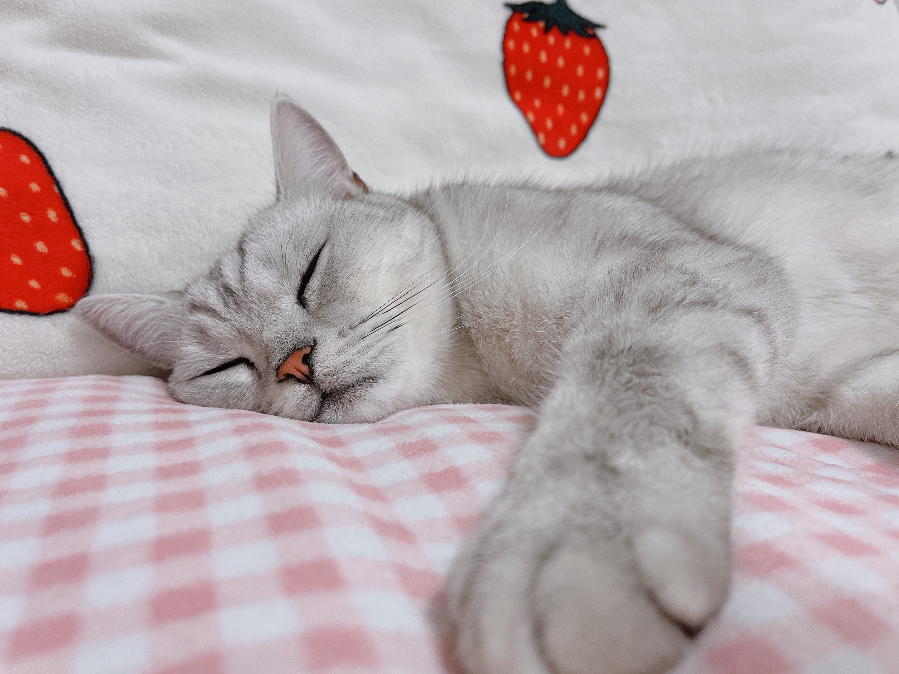

    

        <h1 style="color: black;font-weight: 700;">Dingyi Lin</h1>
        
Phone: (+86)15651792952

        
E-mail: lindingyi@126.com

    

    

    

        

            <h3 style="color: black"><u>Personal information:</u></h3>
            
Highly self-motivated engineering master student with a great passion for research work, and
                individual and team-based projects’ experience. My research interest includes Photovoltaic power and
                Reinforcement Learning.

        

        

            
        

    

    <h3 style="color: black"><u>Education:</u></h3>
    <ul>
        <li style="display: flex;justify-content: space-between;">
            
<b>Master</b>

            
Nanjing Normal University， Electrical Engineering

            
Sep. 2019 - Jul. 2022

        </li>
    </ul>

